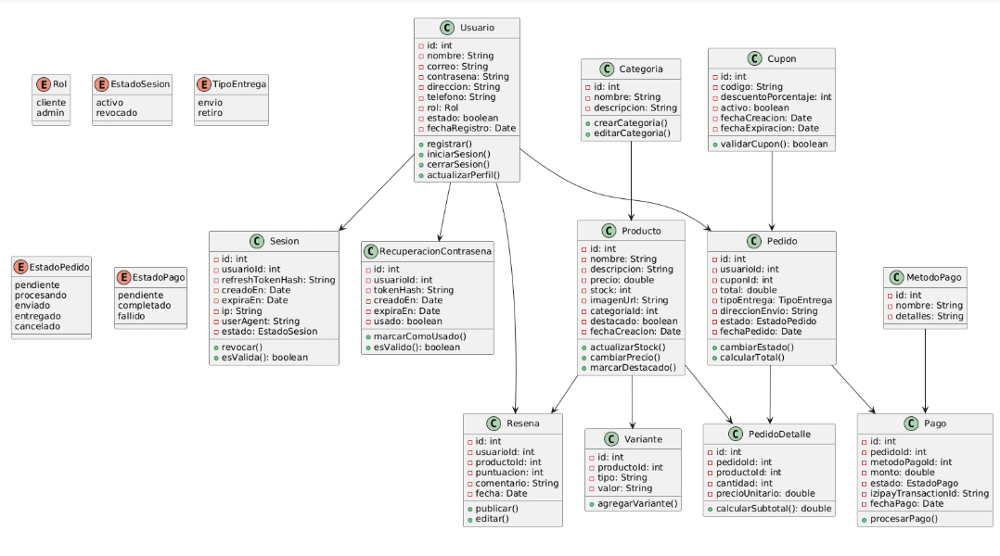
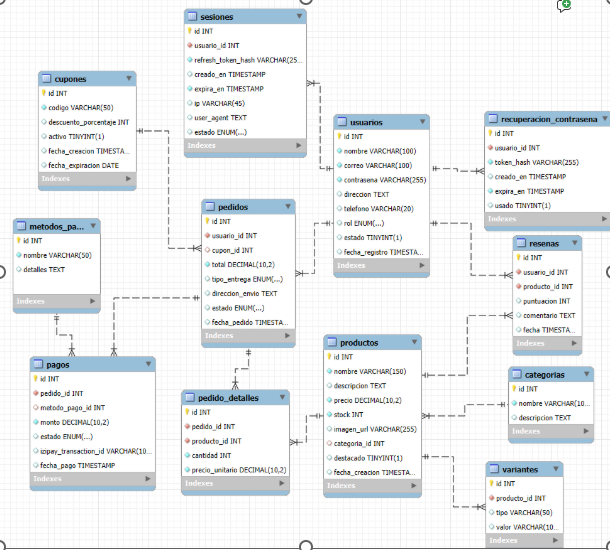

# Tienda Virtual de flores
Un ecommerce donde podras encontrar una varidad significativa de flores para ocasioens especiales
## Características principales

- **Catalogo de productos**: Se encontrada una variedad de productos con un filtro de cada categoria.
- **Compra online**: Se podra comprar mediante una pasarela de pago.
## Características principales
--**Diagramas**



## Tecnologias utilizadas

- **Backend**: Spring Boot (Java 17+), Spring MVC, Spring Data JPA, Spring Security

- **Base de Datos**: MySQL / PostgreSQL

- **Pasarela de Pago**: PagoEfectivo API (opcional)

- **Seguridad**: JWT para autenticación

- **Documentación API**: Swagger / OpenAPI

## Requisitos
- [JDK 1.8](http://www.oracle.com/technetwork/java/javase/downloads/jdk8-downloads-2133151.html)
- [Maven](https://maven.apache.org)
- [Java 17 +](https://www.oracle.com/java/technologies/javase/jdk17-archive-downloads.html)
- [Mysql](https://www.mysql.com/)
- [Spring Boot 3.4.5](https://spring.io/blog/2025/04/24/spring-boot-3-4-5-available-now)
-[Postman](https://www.postman.com/)
## Como empezar

- git (para clonar el proyecto)

  ```sh
  git clone https://github.com/joehhhh11/proyect-floreria
  ```

- Ingresar al proyecto

  ```sh
  cd proyect-floreria
  ```

- Iniciar el proyecto
  ```sh
  ./mvnw spring-boot:run
   ```

## Configuración

- Configura `application.properties` o `application.yml`:

```properties
spring.datasource.url=jdbc:mysql://localhost:3306/tienda_flores
spring.datasource.username=usuario
spring.datasource.password=contraseña

jwt.secret=tuclave
```

- Dependencia para la web
```properties
<dependency>
    <groupId>org.springframework.boot</groupId>
    <artifactId>spring-boot-starter-web</artifactId>
</dependency>
```
## Base de datos

Puedes ver el script completo aquí: [📂 Ver script.sql](docs/floreria_db.sql)
(https://utpedupe-my.sharepoint.com/:x:/g/personal/u19213314_utp_edu_pe/Ea9v0aDoe8ZFr3vldQ0Db_sBIsopKJJPMwW6ZOV5qbM01A?rtime=DusEASub3Ug)

## Pruebas

- Iniciar pruebas
  ```sh
  ./mvnw test
   ```
<<<<<<< HEAD
"# pruebas" 
"# pruebas" 
"# pruebasxd" 
=======
>>>>>>> f987e5c1a22921dce50c4a048c05c5ac1ce4215a
